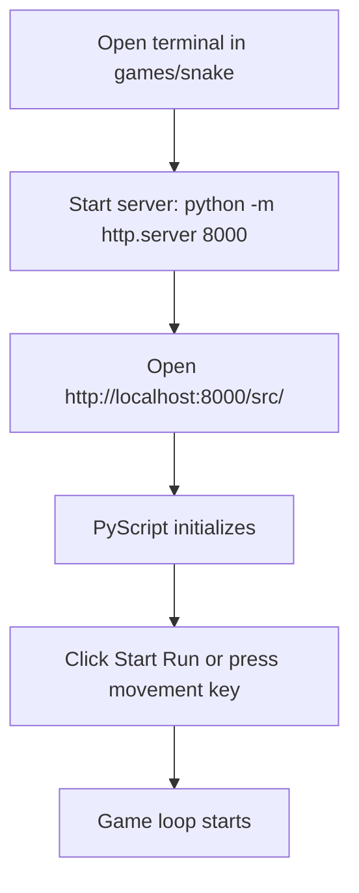
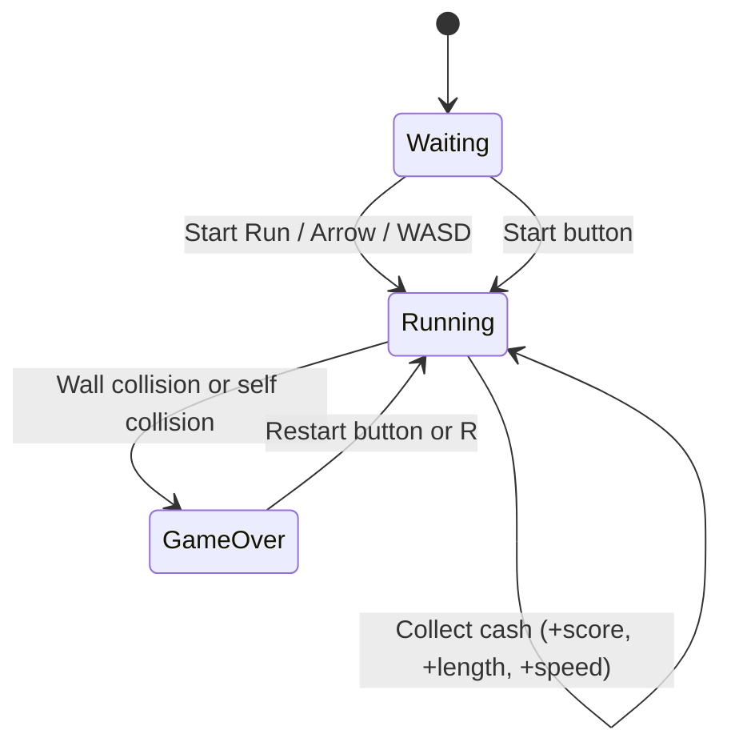
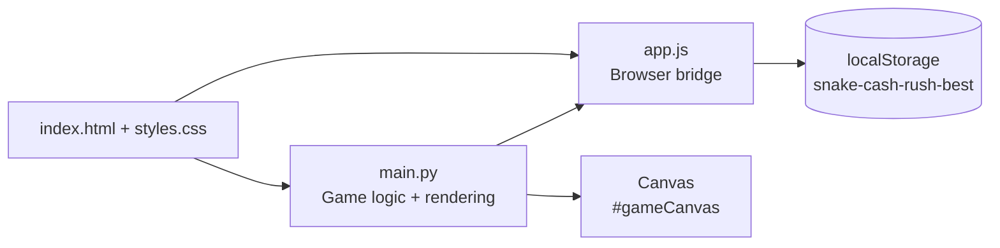

# Snake Cash Rush

Snake Cash Rush is a browser-based Snake game with a finance-themed twist. Collect cash bills, grow your snake, increase your score, and try to beat your best run.

## What This Project Includes

- Python game loop and rules running in-browser through PyScript
- Responsive HTML/CSS interface with HUD, overlay states, and animations
- Keyboard controls (Arrow keys + WASD)
- Persistent best score using browser local storage

## Requirements

- Python 3.10+
- A modern browser (Edge, Chrome, Firefox)
- Internet access on first load (PyScript and Google Fonts are loaded from CDNs)

## How To Run

1. Open a terminal in the project folder:

   ```powershell
   cd games/snake
   ```

2. Start a local static server:

   ```powershell
   python -m http.server 8000
   ```

3. Open the game in your browser:

   ```
   http://localhost:8000/src/
   ```

4. Wait a few seconds for PyScript to initialize, then click **Start Run**.

Note: Do not open `index.html` directly from the file system. PyScript assets should be loaded via HTTP.

## Run Flow Diagram



## How To Play

### Goal

Collect as many cash bills as possible to maximize your score and beat your saved best score.

### Controls

- Move: `Arrow Keys` or `W`, `A`, `S`, `D`
- Restart immediately: `R`
- Start/Restart via button: `Start Run`

### Rules

- Each cash bill collected increases your score.
- The snake grows when you collect cash.
- The game speed ramps up as score increases.
- Hitting a wall or your own body ends the run.
- Best score is saved in local storage (`snake-cash-rush-best`).

## Gameplay State Diagram



## Project Structure

```text
games/snake/
|-- README.md
`-- src/
    |-- index.html      # Game layout, HUD, and PyScript loading
    |-- styles.css      # Visual styling, responsive layout, animations
    |-- app.js          # Browser bridge (RAF + local storage best score)
    `-- main.py         # Core Snake Cash Rush logic and rendering
```

## Project Architecture Diagram



## Troubleshooting

### Game does not start

- Confirm you are running the game at `http://localhost:8000/src/`.
- Check browser dev tools for blocked or failed requests.

### Styles look broken

- Ensure internet access for external CSS/font dependencies.
- Refresh the page after initial load.

### Best score is not saved

- Ensure browser local storage is enabled.
- Private browsing/incognito sessions may clear saved values.