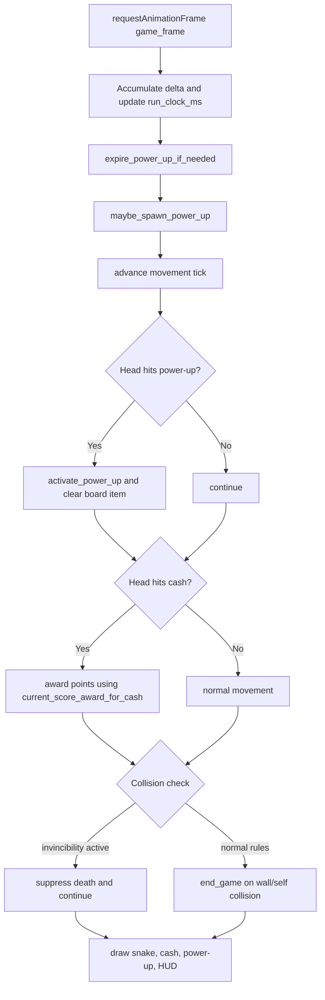

# Design: Snake Cash Rush Power-Up System

## Technical Architecture

The power-up system is implemented entirely inside the existing `SnakeCashRush` browser runtime loop, with no server calls or external timers. New state stays encapsulated in the class and is reset on restart/game over.

### Runtime Model
- Keep one authoritative game loop in `game_frame` and `advance`.
- Introduce a run-local `run_clock_ms` that advances from frame deltas and drives effect expiry/spawn cooldowns.
- Keep one active collectible power-up on board at a time using `board_power_up: PowerUpPickup | None`.
- Keep one active effect state using:
  - `active_power_up_type: str | None`
  - `active_power_up_until_ms: float`
  - derived flags (`score_multiplier`, `invincible`, `effective_tick_ms`).

### Proposed Data Types
- `PowerUpType` values: `speed_boost`, `invincibility`, `double_points`.
- `PowerUpPickup` fields: `type`, `position`, `spawned_at_ms`.
- Optional constants (tunable):
  - `POWER_UP_DURATION_MS_BY_TYPE`
  - `POWER_UP_SPAWN_COOLDOWN_MS`
  - `POWER_UP_SPAWN_CHANCE_PER_CHECK`
  - `SPEED_BOOST_MULTIPLIER`

### Constraint Traceability
| Intent Constraint ID | Intent Constraint | Design Response |
|---|---|---|
| C1 | Browser-based PyScript/Pyodide, no server dependency | All logic is in Python class methods and existing browser loop; no network/storage dependency for effects. |
| C2 | Mutable gameplay state encapsulated in `SnakeCashRush` | All new mutable fields (`board_power_up`, active effect, timers) are instance fields. |
| C3 | Keep movement controls and restart behavior unchanged | Input mapping and restart entry points are unchanged; power-ups only alter collision/scoring/speed behavior. |
| C4 | No perceptible frame stutter | No extra per-frame allocations beyond lightweight checks; O(1) active-effect checks and bounded spawn checks. |
| C5 | Active effect and remaining duration visible | Add dedicated HUD status text for active effect + countdown updated each frame or tick. |
| C6 | Existing cash scoring (+10) as baseline | Base score constant unchanged; multiplier only applied while `double_points` active. |

## Component Breakdown

### 1) State Extension in `SnakeCashRush`
- Add power-up fields to `reset_state` and clear them in `end_game`/`restart_game` path:
  - `board_power_up`
  - `active_power_up_type`
  - `active_power_up_until_ms`
  - `run_clock_ms`
  - `next_spawn_check_ms`

### 2) Spawn Manager
- New method `maybe_spawn_power_up()`:
  - Runs only while game is active.
  - Checks cooldown and chance.
  - Picks valid unoccupied cell (not snake, not cash).
  - Chooses type via weighted/random policy.

### 3) Effect Engine
- New methods:
  - `activate_power_up(power_up_type: str)`
  - `expire_power_up_if_needed()`
  - `current_score_award_for_cash() -> int`
  - `current_tick_ms() -> float`
- Responsibilities:
  - Apply temporary overrides for speed, invincibility, and score multiplier.
  - Auto-expire based on `run_clock_ms`.

### 4) Collision and Scoring Integration
- `advance()` integration points:
  - Before collision resolution: decide if invincibility suppresses death.
  - On cash collection: use `current_score_award_for_cash()`.
  - On movement timing: use `current_tick_ms()` so temporary speed boost reverts automatically.
  - On board pickup collection: call `activate_power_up` and clear pickup.

### 5) Rendering and HUD
- Add `draw_power_up(ctx)` called from `draw()`.
- Add power-up-specific visual language (shape/color/icon) distinct from cash and snake.
- Add/update HUD element for active effect:
  - Displays effect label and remaining seconds when active.
  - Displays idle/default message when none active.

### 6) Debug Snapshot Surface
- Extend `snapshot_json()` payload with:
  - `boardPowerUp`
  - `activePowerUpType`
  - `activePowerUpRemainingMs`
  - `isInvincible`
  - `scoreMultiplier`
  - `effectiveTickMs`

## Data Flow

### State Transition Notes
- Start run: initializes empty effect state and starts spawn scheduler.
- Collect power-up: effect activation updates expiry deadline and HUD immediately.
- Expiry: at/after deadline, effect flags are removed and defaults restored.
- Restart/game over: clears active effects, timers, and board power-up item.

## API Contracts

### Internal Method Contracts (Python)
- `maybe_spawn_power_up() -> None`
  - Must never spawn on snake body/head or current cash cell.
- `spawn_power_up(snake: Iterable[Point], cash: Point) -> PowerUpPickup | None`
  - Returns `None` if no valid cells.
- `activate_power_up(power_up_type: str) -> None`
  - Sets active type and expiry timestamp according to duration map.
- `expire_power_up_if_needed() -> None`
  - Clears active effect when current run clock passes expiry.
- `current_score_award_for_cash() -> int`
  - Returns 10 by default, 20 during active double points.
- `current_tick_ms() -> float`
  - Returns baseline progression tick unless speed boost override is active.

### UI/DOM Contract
- Add one HUD element id: `powerUpStatus`.
- Rendering contract:
  - `speed_boost`: visually distinct marker A.
  - `invincibility`: visually distinct marker B.
  - `double_points`: visually distinct marker C.
- Status examples:
  - `Power-Up: Invincibility (2.4s)`
  - `Power-Up: None`

### Debug Contract
- Existing bridge helpers remain compatible.
- `window.snakeCashRushSnapshot()` returns additional fields listed above without removing existing fields.

### Acceptance Criteria Traceability
| Acceptance Criterion ID | Requirement | Design Coverage |
|---|---|---|
| AC1 | Spawn collectible power-up on valid unoccupied cells; visually distinguishable | Spawn manager + `spawn_power_up` occupancy checks + `draw_power_up` visual variants. |
| AC2a | Speed boost temporary faster state with auto-revert | `current_tick_ms` + expiry engine using deadline. |
| AC2b | Invincibility temporary collision immunity with restore | Collision branch checks active invincibility; normal collision restored on expiry. |
| AC2c | Double points temporary 2x cash scoring then baseline +10 | `current_score_award_for_cash` returns 20 only while active, otherwise 10. |
| AC3 | HUD shows active effect + live remaining duration | `powerUpStatus` updated from active type and remaining ms in render/tick path. |
| AC4 | Restart/game over clears all active power-up state and preserves existing flow | Reset/clear state in `reset_state` and end/restart transitions; no input flow changes. |
| AC5 | Snapshot/debug exposes active type and remaining duration | `snapshot_json` includes `activePowerUpType` and `activePowerUpRemainingMs`. |

## Key Design Decisions

### Decisions Made for Phase 2 Design
- Keep implementation inside one class (`SnakeCashRush`) to satisfy state encapsulation constraints.
- Use deadline-based effect timing (`active_power_up_until_ms`) instead of separate timers for deterministic behavior in fixed-step gameplay.
- Keep existing cash item behavior independent from power-up item spawning.

### Assumptions and Decision Placeholders (from Open Questions)
| Topic | Assumption Used in Design | Decision Placeholder |
|---|---|---|
| Spawn cadence/chance | Time-based spawn checks with cooldown + random chance | [DECISION REQUIRED: exact cooldown ms and probability values] |
| Cash + power-up coexistence | Yes, both can exist simultaneously on different cells | [DECISION REQUIRED: confirm coexistence policy] |
| Multiple active power-ups | Single active effect at a time | [DECISION REQUIRED: single-active vs multi-active stacking] |
| Same-type recollection while active | Refresh duration to full for that type | [DECISION REQUIRED: refresh vs extend vs ignore] |
| Effect durations | Per-type configurable durations | [DECISION REQUIRED: exact duration per type] |
| Speed boost model | Multiplier applied to computed tick interval | [DECISION REQUIRED: multiplier vs fixed tick reduction vs override] |
| Invincibility collision behavior | Suppress death check; snake movement continues normally | [DECISION REQUIRED: pass-through vs bounce vs clip specifics] |
| Invincibility interaction scope | Only death checks change; scoring/progression remain normal | [DECISION REQUIRED: should invincibility affect anything else] |
| Double points scope | Applies only to cash pickups | [DECISION REQUIRED: include future score events or not] |
| HUD placement | Dedicated line in status area (`powerUpStatus`) | [DECISION REQUIRED: confirm final HUD location and wording] |
| Visual language | Distinct shape/color per power-up on canvas | [DECISION REQUIRED: approve specific art direction] |
| Persistence across runs | Run-local only, no long-term power-up stats | [DECISION REQUIRED: track aggregate stats or not] |

## Tradeoffs and Alternatives

1. Single active effect vs stacked effects
- Chosen: single active effect (lower complexity, easier balancing, clearer HUD).
- Alternative: multi-effect stacking (more depth but harder collision/timing/scoring interactions and debug complexity).

2. Deadline-based timing vs decrement-per-tick counters
- Chosen: absolute run-clock deadlines (stable under frame jitter, straightforward snapshot values).
- Alternative: decrement counters in ticks (simple conceptually, less precise under variable frame deltas).

3. Time-based spawning vs score-triggered spawning
- Chosen: time-based checks with probability (smooth pacing independent of player score spikes).
- Alternative: score milestones (predictable but may starve low-skill runs and cluster in high-skill runs).

4. Dedicated HUD field vs overloading status text
- Chosen: dedicated HUD field (clear persistent visibility for AC3).
- Alternative: rotating status text (less UI change, but easier to miss and conflicts with run-state messages).

5. Invincibility as death-check suppression vs map-physics override
- Chosen: death-check suppression only (minimal behavior regression risk).
- Alternative: pass-through/bounce mechanics (more dramatic but requires larger movement/collision refactor).
